# postgresql-cst-parser 構築の流れ

本ドキュメントは postgresql-cst-parser の構築方法と内部構造を説明し、本ツールの保守に必要な知識を得ることを目的としている。LR 構文解析のアルゴリズムについてはパーサー本体の挙動を理解するために必要なためやや詳しく記載したが、一般的な理論の詳細については省略した。

初めに全体像を簡単に説明し、それから字句解析器の構築、構文解析器の構築について記載する。その後パーサーの動作について説明し、最後に PostgreSQL のアップデートに追従する手順を記載する。

## 目次

1. [全体像](#全体像)
2. [字句解析器の構築](#字句解析器の構築)
   - [入力ファイル](#入力ファイル)
   - [処理の流れ](#処理の流れ)
   - [DFA の構築](#dfa-の構築)
3. [構文解析器の構築](#構文解析器の構築)
   - [入力ファイル](#入力ファイル-1)
   - [構文解析表](#構文解析表)
   - [LALR(1) への変換](#lalr1-への変換)
   - [衝突の解決](#衝突の解決)
   - [構文解析表の圧縮](#構文解析表の圧縮)
4. [パーサーの動作](#パーサーの動作)
   - [トークン補正](#トークン補正)
   - [構文解析の例](#構文解析の例)
5. [PostgreSQL の更新を取り込む](#postgresql-の更新を取り込む)

## 全体像

本パーサーは以下の流れで CST を構築する。

1. PostgreSQL のソースの一部である scan.l と kwlist.h から字句解析器を構築する
2. gram.y と字句解析器構築時に出力したトークン種別の列挙型から構文解析器を構築する
3. 字句解析 → トークン補正 → 構文解析の順で CST を生成する

字句解析器、構文解析器のデータの流れを図で表現すると以下のようになる。

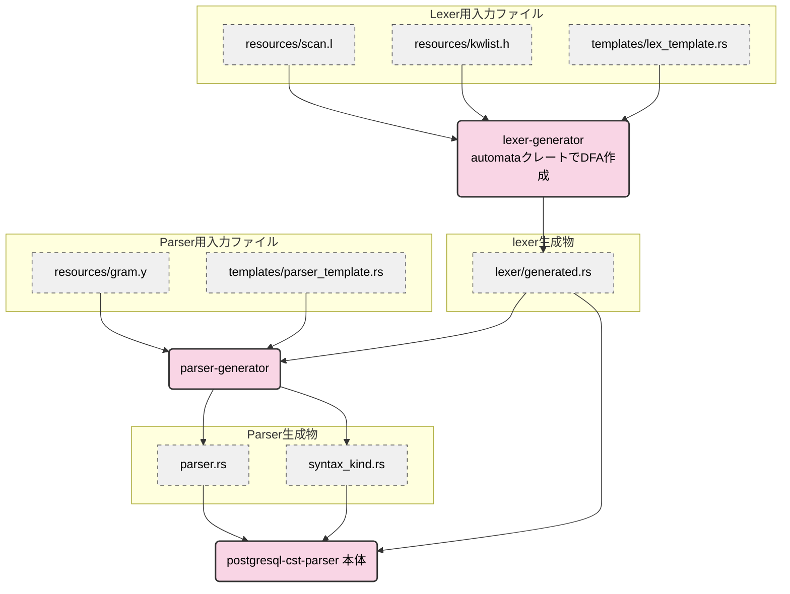

## 字句解析器の構築

### 入力ファイル

字句解析器の構築には以下のファイルを使用する。

- kwlist.h: PostgreSQL のソースからそのまま使用。キーワードとトークンのマップを構築する
- scan.l: PostgreSQL のソースに libpg_query のパッチを当て、さらに Rust へ手動でポーティングしたもの

### 処理の流れ

scan.l から状態、パターン、ルールを読み込み（`parse_flex_file()`）、各状態ごとに DFA を構築する。

#### 状態

字句解析器の状態を宣言する。`%x` の後の文字列が状態の名前となる。

```
%x xh
```

#### パターン

正規表現パターンに名前を付ける。

```
newline				[\n\r]
xhinside		[^']*
xbinside		[^']*
```

#### ルール

各状態でパターンにマッチしたときのアクションを定義する。`<..>` でどの状態のアクションかを表し、それに続いて正規表現パターンを記載することができる。正規表現パターンでは `{..}` と中括弧でパターン名をくくることで前述のパターンを参照することができる。`|` で次のルールと同じアクションを共有できる。

```
<xh>{xhinside}	|
<xb>{xbinside}	{
					// addlit(yytext, yyleng, yyscanner);

					self.addlit(self.yyleng);
				}
```

### DFA の構築

DFA は以下の手順で構築する。

1. Thompson の構成法で正規表現から NFA を構築
2. 部分集合構成法で NFA を DFA に変換

#### Thompson の構成法

連接・選択・繰り返しなどの基本 NFA を合成して、あるルールを受理する NFA を構築する（`build_nfa_from_regex_node()`）。
ある状態の全ルールの NFA は、開始状態から各 NFA へ epsilon 遷移でつなぐことで一つの NFA に統合する。

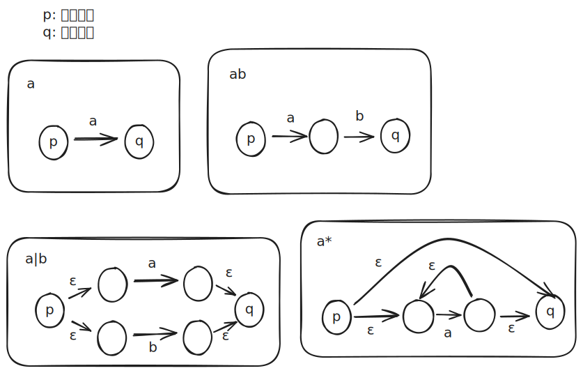

#### 部分集合構成法

NFA は非決定性のため、ある入力に対して複数のノードに存在する可能性がある。
部分集合構成法では、ある入力に対して存在しうる NFA のノードの集合を一つのノードとみなして DFA を構築する（`construct_dfa_with_state_mapping()`）。

## 構文解析器の構築

gram.y から LALR(1) 法で構文解析表を構築し（`build_lalr1_parse_table()`）、圧縮して出力する。

### 入力ファイル

gram.y は PostgreSQL のソースに libpg_query のパッチを当てて使用する（`parse_bison()` でパース）。
gram.y には以下の要素が含まれている（構文解析器が使用しない要素の説明は省略する）。

1. トークン一覧
2. 各トークンの結合規則
3. 文法規則と優先度

### トークン一覧

`%token` でトークンを定義する。
トークンの型を含む記述もあるが、構文解析器では不要なので読み飛ばす。

```
%token <str>	IDENT UIDENT FCONST SCONST USCONST BCONST XCONST Op
%token <ival>	ICONST PARAM
%token			TYPECAST DOT_DOT COLON_EQUALS EQUALS_GREATER
```

### 結合規則

`%left`, `%right`, `%nonassoc` で結合規則を定義する。下にあるほど優先度が高い。

```
/* Precedence: lowest to highest */
%left		UNION EXCEPT
%left		INTERSECT
%left		OR
%left		AND
%right		NOT
%nonassoc	IS ISNULL NOTNULL	/* IS sets precedence for IS NULL, etc */
%nonassoc	'<' '>' '=' LESS_EQUALS GREATER_EQUALS NOT_EQUALS
%nonassoc	BETWEEN IN_P LIKE ILIKE SIMILAR NOT_LA
%nonassoc	ESCAPE			/* ESCAPE must be just above LIKE/ILIKE/SIMILAR */
```

### 文法規則

以下は a_expr の文法規則の定義の一部である。

```
a_expr:		c_expr									{ $$ = $1; }
			| a_expr TYPECAST Typename
					{ $$ = makeTypeCast($1, $3, @2); }
			| a_expr COLLATE any_name
				{
					CollateClause *n = makeNode(CollateClause);

					n->arg = $1;
					n->collname = $3;
					n->location = @2;
					$$ = (Node *) n;
				}
			| a_expr AT TIME ZONE a_expr			%prec AT
```

#### アクション

文法規則の末尾にある `{}` にはアクションと呼ばれる C 言語のコードが書かれており、reduce 時に実行する。PostgreSQL の文法規則には存在しないが文法規則の途中にアクションを書くことも可能である（mid-rule action）。その場合直前の要素をスタックに積んだ直後に実行する。
現状の構文解析器ではアクションは使用しないので読み飛ばす。

#### 複数の文法規則

ある非終端記号に複数の文法規則が対応する場合は `|` でつなぐことができる。

#### 優先度の上書き

各文法規則には優先度が存在する。デフォルトではその文法規則の最後の終端記号の優先度が使用されるが、`%prec` でその文法規則の優先度を上書きすることもできる。優先度は shift/reduce 衝突の解決に使用する。shift の優先度は次に読む終端記号の優先度、reduce の優先度はその文法規則の優先度である。

### 構文解析表

構文解析器の構築で行うことは、構文解析表の構築である。構文解析表は 2 つの表から構成される。

- ACTION 表: 構文解析の状態（行）と終端記号（列）の組み合わせで、実行すべきアクション（shift/reduce/accept/error）と遷移先の状態を表現する
- GOTO 表: 構文解析の状態（行）と非終端記号（列）の組み合わせで、reduce 後に遷移すべき状態を表現する

#### LR(1) 項と状態

LR(1) 項とは、以下の 2 つの情報の組である。

1. どの文法規則のどの位置までパース済みか（ドット位置で表現）
2. この文法規則の直後にくる終端記号（先読み記号）

例えば `[expr → expr • '+' expr, $]` は「`expr` の最初の要素まで読み終わり、先読み記号が `$` である」ことを表す。

LR(1) 構文解析における**状態**は、単一の LR(1) 項ではなく、**LR(1) 項の集合**（閉包）である。閉包操作（`Lalr::closure()`）とは、ドットの直後に非終端記号がある項に対して、その非終端記号を左辺に持つすべての文法規則について、先頭にドットを置いた項を追加する操作である。追加する項の先読み記号は、元の項における「ドットより後ろの記号列 + 元の先読み記号」の FIRST 集合（`build_first_set()` で構築）から求める。閉包により、現在の状態で次に来る可能性のあるすべての記号を把握できる。

### 構文解析表作成の例

文法 `expr → expr '+' expr | DIGIT`（`+` は左結合）で入力 `DIGIT + DIGIT` をパースする例を示す。
まず、この文法に対応する構文解析表を示す。

#### 文法規則

- (1) expr → expr '+' expr
- (2) expr → DIGIT
- (3) main → expr

構文解析の状態と遷移は以下のようになる。

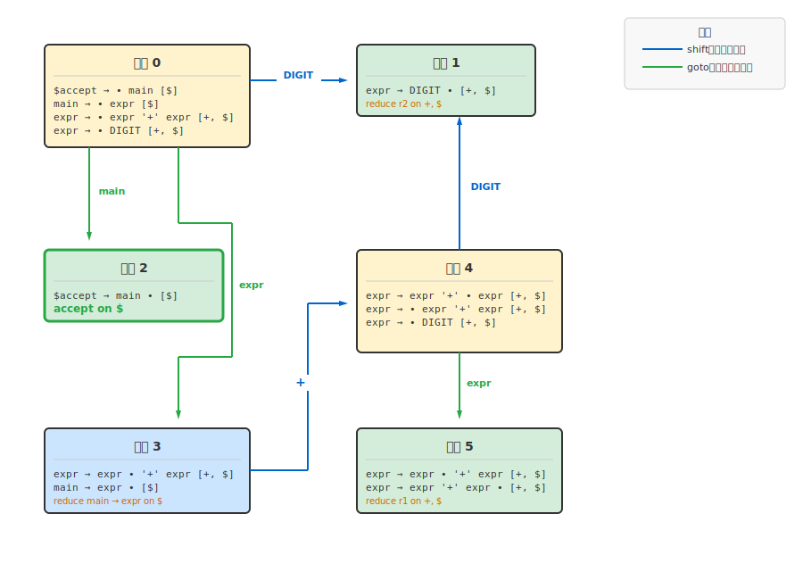

これを構文解析表に変換すると、以下のようになる。

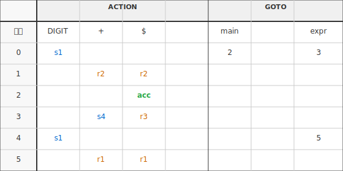

- **sN**: shift して状態 N へ遷移
- **rN**: 規則 N で reduce
- **acc**: 受理（構文解析成功）
- 空欄: エラー

注: 状態 5 で `+` に対して r1（reduce）となるのは `%left '+'`（左結合）による衝突解決の結果である。

### LALR(1) への変換

LR(1) では状態数が膨大になるため、LALR(1) を使用する。
LALR(1) は、LR(1) の状態のうち「文法規則」と「ドット位置」が同じで「先読み記号」だけが異なる状態をマージしたものである（`State::equals_without_lookahead()` で比較）。
これにより状態数を大幅に削減できるが、まれに LR(1) では発生しない衝突が発生することがある。

### 衝突の解決

ある状態で同じ終端記号を先読みしたときに shift と reduce の両方が可能な場合（shift/reduce 衝突）、以下のルールで解決する。

1. 優先度が高い方を採用する
2. 優先度が同じなら結合性で決定する
   - `%nonassoc` → エラー
   - `%left` → reduce
   - `%right` → shift
3. 優先度も結合性も指定されていない場合、Bison の仕様では shift を採用する

### 構文解析表の圧縮

完成した構文解析表は非常に巨大になっている。
各状態で最も多いアクションをデフォルトアクションとして特殊な値を割り当てた後に（`find_most_common_action()`）、完全に同一の行をマージして表を圧縮する（`compress_action_table()`、`compress_goto_table()`）。

## パーサーの動作

パーサー本体は `postgresql-cst-parser` クレートにある。字句解析は `lex()` で行い、トークン補正（`init_tokens()`）を経て、構文解析は `parse()` で行う。構文解析中の ACTION 表の参照は `lookup_parser_action()`、GOTO 表の参照は `lookup_goto_state()` で行う。構文解析では、前節で説明した構文解析表を使用して shift/reduce を繰り返す。

### トークン補正

字句解析と構文解析の間で、特定のトークン列を別のトークンに置き換える処理を行う。これは PostgreSQL の `base_yylex()` 関数に相当する処理である。

[PostgreSQL の parser.c のコメント](https://github.com/postgres/postgres/blob/REL_16_STABLE/src/backend/parser/parser.c#L89-L94) によると、SQL 文法では一部の構文で複数トークンの先読みが必要になるが、LALR(1) パーサーは 1 トークンの先読みしかできない。そこで、字句解析後に先読みを行い、特定のトークン列を検出したら先頭のトークンを別のトークン（`_LA` 接尾辞付き）に置き換えることで、文法を LALR(1) に保っている。

現在の補正パターンは以下の 5 種類である。

| 元トークン | 次トークン | 変換後 | 例 |
|-----------|-----------|--------|-----|
| FORMAT | JSON | FORMAT_LA | COPY … FORMAT JSON |
| NOT | BETWEEN, IN_P, LIKE, ILIKE, SIMILAR | NOT_LA | WHERE x NOT IN (…) |
| NULLS_P | FIRST_P, LAST_P | NULLS_LA | ORDER BY x NULLS FIRST |
| WITH | TIME, ORDINALITY | WITH_LA | TIMESTAMP WITH TIME ZONE |
| WITHOUT | TIME | WITHOUT_LA | TIMESTAMP WITHOUT TIME ZONE |

### 構文解析の例

以下に、文法 `expr → expr '+' expr | DIGIT`（`+` は左結合）で入力 `DIGIT + DIGIT` をパースする例を示す。

#### 初期状態

記号スタックの `$` は構文解析の開始位置を示す初期記号、入力末尾の `$` は入力の終端を表す終端記号である。

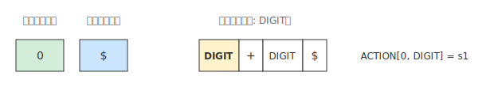

#### ステップ 1: shift（DIGIT を読み込み、状態 1 へ遷移）

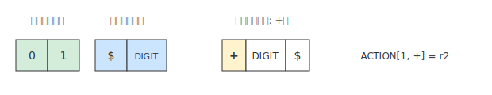

#### ステップ 2: reduce（expr → DIGIT を適用）

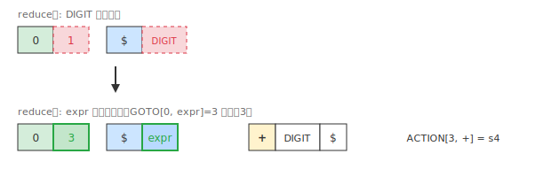

#### ステップ 3: shift（+ を読み込み、状態 4 へ遷移）

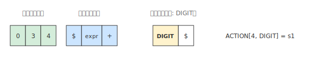

#### ステップ 4: shift（DIGIT を読み込み、状態 1 へ遷移）


#### ステップ 5: reduce（expr → DIGIT を適用）→ GOTO[4, expr] = 5

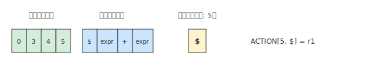

#### ステップ 6: reduce（expr → expr '+' expr を適用）→ GOTO[0, expr] = 3

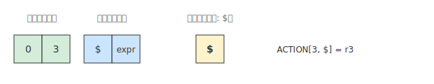

#### ステップ 7: reduce（main → expr を適用）→ GOTO[0, main] = 2

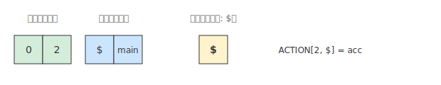

#### ステップ 8: accept

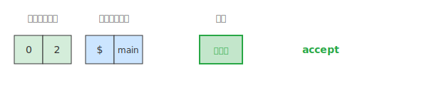

最終的に入力をすべて消費し、accept となり、構文解析が成功する。

## PostgreSQL の更新を取り込む

1. libpg_query が PostgreSQL の更新を取り込むのを待つ
2. libpg_query のバージョンアップ後のブランチを確認し、Makefile の git clone の引数で指定しているブランチを変更する
3. `make prepare-source` で PostgreSQL のソースコードに libpg_query の patch を当てたものを postgresql-cst-parser に取り込む
4. scan.l は、元々の Rust ポーティング済みのものとうまくマージしつつ、Rust へのポーティングが必要なところは追加でポーティングする
5. parser.c の差分を確認し、`base_yylex` 内で行っているトークン書き換え処理に差分がある場合、それをポーティングする
6. `build.sh` を実行してパーサーを生成する
7. 新文法をテストに追加してパースできることを確認する
8. `make make-patch` で scan.l のパッチファイルを生成し、すべてコミットする
